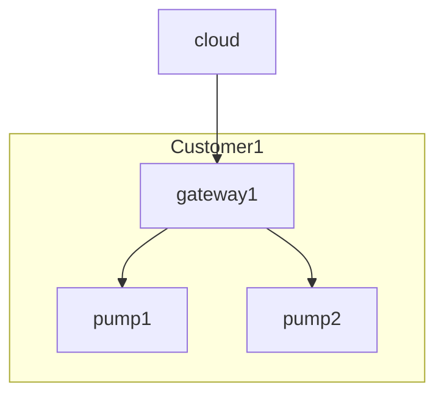
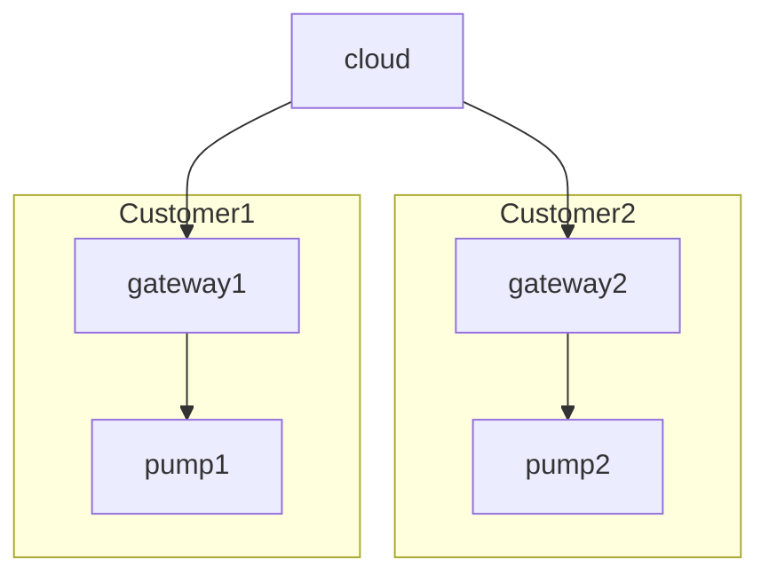

# Rentable Equipment

A company which manufacturers water pumps, but instead of selling the pumps to customers, they rent the equipment out for a period of time.

This means that the water pumps will be going from customer to customer, however the company needs to keep track of the id of the pump so that they can manage the required maintenance. The company renting the pump is free to use or not-use the pump as much as they want, however they billing model takes into account how long the pump is running (operational hours) as this has a direct relationship to how often a pump must be serviced (including replacing some critical components).

Focusing on a single pump, the data for the pump needs to be easily tracked to monitor the operating hours to plan the pump's servicing. The company manufacturing the pump knows when the pump but previously they were not able to monitor the usage of the pump whilst it was rented out. Due to the lack of information, an estimated usage per rental period was calculated, however this would often be wrong as the each customer's usage patterns would be wildly different. As a result, the pumps were often failing due to be over-worked.

### Overview

Since the equipment (in this case a pump) is being rented out to different customers, ideally the id of the pump should remain the same across different installations.

Let's model the pump as a child device in thin-edge, but the pump which is connecting to thin-edge is not very interesting, so thin-edge should be treated as a transparent gateway where there gateway should not influence the identity of the pump itself. This allows the pump to be moved around, and it could even be used against different thin-edge gateways during its lifetime.

Each customer can rent any number of pumps at one time, and the rental period for each pump may be different (depending on the customer's need). In order to monitor the pumps, the pumps connect to a gateway (in this case thin-edge), and thin-edge handles the Cloud IoT aspects (connectivity, device management, monitoring etc.).

Customer1 rents out two pumps; **pump1** and **pump2**. However the customer does not need both pumps for the entire time, so **pump2** will be returned after 2 weeks, whereas **pump1** has been rented out for a few months.



**Customer1** then returns **pump2** after the 2 weeks, then the same pump is rented out to a different customer, **Customer2**. The diagram shows the new overview tracking where each pump is located.



### Topic structure

In this case, thin-edge should act more like a transparent gateway where each device is fully capable to describe itself.

Each pump will be modelled as a child device of the thin-edge device, as thin-edge still needs to be used to facilitate the communication, however each child device should be uniquely identifiable via its own information.

Therefore, the topic structure to facilitate this will be give different semantic meanings to the 4-part topic structure offered by thin-edge.

```text
te/[ManufacturerId]/[SerialNumber]/[Application]/[Instance]/[Channel]
```

|Segment|Description|
|-------|-----------|
|`ManufacturerId`|Manufacturer id. Either the name of a unique code representing the manufacturer|
|`SerialNumber`|Device serial number (or part number)|
|`Application`|Optional application name to indicate which data is transmitting the data to the consumers. It can be left blank|
|`Instance`|If multiple instances of the application, then it can be used to indicate which instance of the application is the telemetry data representing. It can be left blank|

:::info
The manufacturer id is used to namespace the device serial numbers as the serial numbers are not guaranteed to be unique between different manufacturers, however it is generally unique within a single manufacturer, and if this is not the case the model number could also be added as a prefix to the `SerialNumber` segment).
:::

### Registration

Since custom thin-edge topic semantics are being used, each device must be registered in order for thin-edge to know what kind of entity/component the data is related to. For example, publishing to `te/flowserve/pump1234///` needs to be treated as a "child-device" and not a "service". Generally the distinction between a child-device and service will not be relevant in the local thin-edge MQTT broker domain, however it is generally required for mapping the entities to the cloud digital twins.


#### Register a pump

Let's assume we have a single pump that needs to be registered with thin-edge. The pump's information is as follows.

|Property|Value|Description|
|--------|-----|-----------|
|ManufacturerId|flowserve|Manufacturer id of the equipment|
|SerialNumber|AF012345|Pump serial number which is unique within the manufacturer id|

The pump can be registered using a custom id, however it will still follow the topic structure closely so it is still easy to track the relationship between the id and topic names.

```sh te2mqtt
tedge mqtt pub -r 'te/flowserve/AF012345' '{
  "@id": "te:flowserve:AF012345",
  "@type": "child-device"
}'
```

The pump should be identifiable in the Cloud IoT via `te:flowserve:AF012345`. It will **NOT** include thin-edge's device-id (e.g. the device certificate's CommonName field).

:::tip
The `@id` fields should not use slashes `/` in its name. This is because a slash can often cause problems with other API offered by IoT platforms, for example REST API.

To avoid this, just replace slash `/` with a colon `:`.
:::

#### Register telemetry meta data

In additional to registering the device, the pump will also publish some meta information about the telemetry data that the pump will be sending. To keep it simple it will just register one measurement (the operating hours) and one alarm (alarms when the operating hours exceeds the 1000 hour threshold).

Registering the meta information about the pump's operating hours.

```sh te2mqtt
tedge mqtt pub -r 'te/flowserve/AF012345///m/runtime/meta' '{
  "msg": "Operating hours",
  "unit": "h",
  "desc": "Number of operating hours. The pump should be serviced after 1000 hours!",
  "range": [0, 2000]
}'
```

A related alarm which indicates when the pump should be serviced.

```sh te2mqtt
tedge mqtt pub -r 'te/flowserve/AF012345///a/service_required/meta' '{
  "msg": "Service pump",
  "desc": "The pump is need of service. Please contact the company to schedule a service"
}'
```

The child device is now registered, so the pump can start sending operating hours as measurements.

```sh te2mqtt
tedge mqtt pub 'te/flowserve/AF012345///m/runtime' '{
  "operating_hours": 10
}'
```

The pump (or the application monitoring the pump) can send an alarm indicating that the pump needs to be serviced using:

```sh te2mqtt
tedge mqtt pub 'te/flowserve/AF012345///a/service_required' '{
  "text":"Service pump",
  "severity":"WARNING"
}'
```


### Interacting with other services

Let's say that you are also building a local UI to display the values.

The UI wants to be able to display all the telemetry data from a specific pump. The UI can subscribe to the meta information for all measurements by using the following MQTT subscription:

```sh te2mqtt
tedge mqtt sub 'te/flowserve/AF012345///m/+/meta'
```

```text title="Output"
{"msg":"Operating hours","unit":"h","desc":"Number of operating hours. The pump should be serviced after 1000 hours!","range":[0,2000]}
```

Alternatively, if the local UI wants to subscribe to all of the telemetry data related to the pump (e.g. measurements, alarms etc.), then it can use the following subscription:

```sh te2mqtt
tedge mqtt sub 'te/flowserve/AF012345///+/+/meta'
```

:::tip
When an MQTT client received a message, it also has access to the MQTT topic related to the message. This topic should be used to derive information about the source of the message, in this case to read what pump and type of measurement the meta data is describing.
:::

Now the UI knows how to the display the value when a new flow rate is published, it can use the display the value in metres per second (m/s).

## Helpful CLI commands

### Get list of registered devices

The mosquitto subscribe cli command can be used to generate a single JSON object containing all of the registered devices.

The key is to use the timeout argument `-W <seconds>` to only listen for a brief period of time, as the registration messages should be sent with as retained messages.

`jq` is then used to combine the json formatted payloads to a single json object.

```sh
mosquitto_sub -t 'te/+/+' -F '{"%t":%p}' -W 1 | jq -s 'add'
```

```json title="Output"
{
  "te/device/child01": {
    "@type": "child-device",
    "displayName": "child01",
    "type": "SmartHomeHub"
  },
  "te/device/child02": {
    "@type": "child-device",
    "displayName": "child02",
    "type": "SmartHomeHub"
  },
  "te/device/nested_child01": {
    "@type": "child-device",
    "@parent": "te/device/child01",
    "displayName": "nested_child01"
  },
  "te/flowserve/AF012345": {
    "@id": "te:flowserve:AF012345",
    "@type": "child-device"
  }
}
```

Or a full list of registered entities and components can be retried by subscribe to both registration topics.

```sh
mosquitto_sub -t 'te/+/+' -t 'te/+/+/+/+' -F '{"%t":%p}' -W 1 | jq -s 'add'
```

```json title="Output"
{
  "te/device/child01": {
    "@type": "child-device",
    "displayName": "child01",
    "type": "SmartHomeHub"
  },
  "te/device/child02": {
    "@type": "child-device",
    "displayName": "child02",
    "type": "SmartHomeHub"
  },
  "te/device/nested_child01": {
    "@type": "child-device",
    "@parent": "te/device/child01",
    "displayName": "nested_child01"
  },
  "te/flowserve/AF012345": {
    "@id": "te:flowserve:AF012345",
    "@type": "child-device"
  },
  "te/device/child01/service/tedge-agent": {
    "@type": "service",
    "@parent": "te/device/child01",
    "displayName": "tedge-agent",
    "type": "systemd"
  },
  "te/device/child01/service/nodered": {
    "@type": "service",
    "@parent": "te/device/child01",
    "displayName": "nodered",
    "type": "systemd"
  },
  "te/device/nested_child01/service/nodered": {
    "@type": "service",
    "@parent": "te/device/nested_child01",
    "displayName": "nodered",
    "type": "systemd"
  },
  "te/device/main/service/nodered": {
    "@type": "service",
    "status": "down"
  },
  "te/device/main/service/mosquitto-c8y-bridge": 1,
  "te/device/main/service/tedge-mapper-template": {
    "@type": "service",
    "status": "up"
  }
}
```

### Clear a retained message

A retained message can be cleared by publishing an empty retained message to the same topic.

For example if the a retained message is already published to `te/flowserve/AF012345//`, it can be cleared using:

```sh
mosquitto_pub -r -n -t te/flowserve/AF012345//
```
