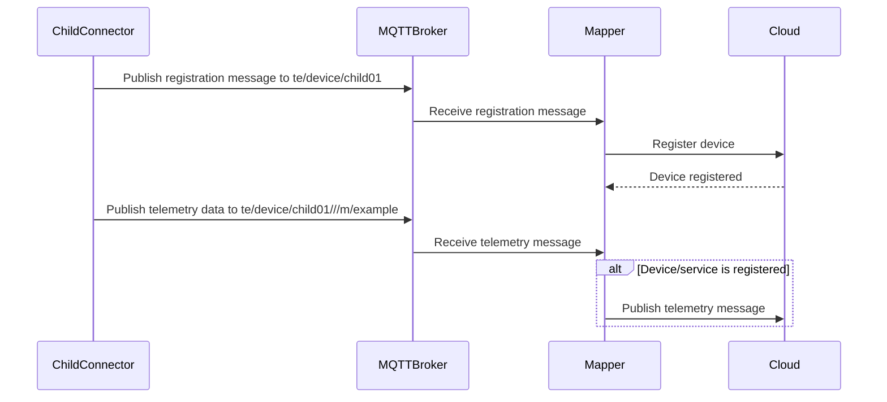
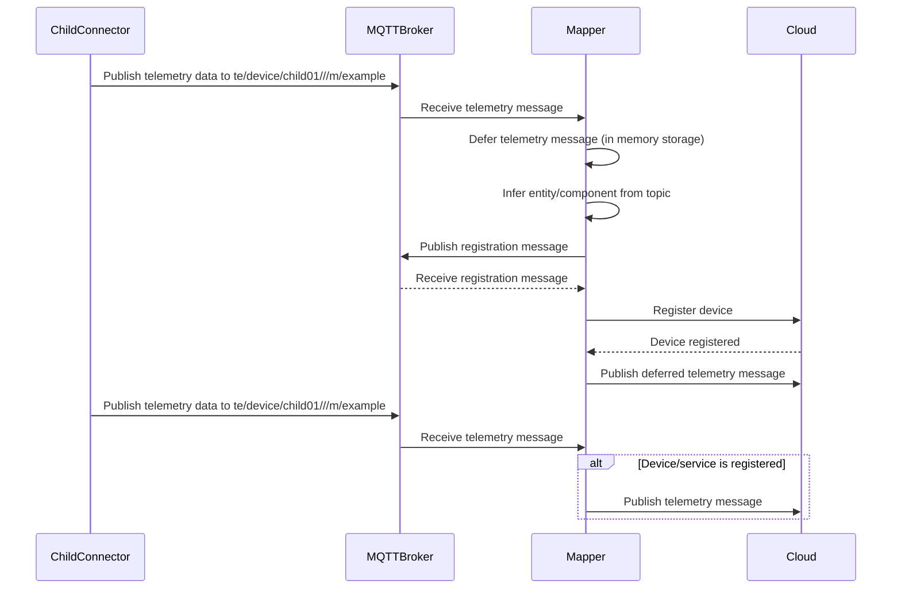

## Overview

Automatic registration relies on user-defined configuration to provide a link between the topic names and the entity/component types.

The only difference between automatic and manual registration, a thin-edge component takes over the publishing of the registration message for the other entity/component rather than relying on a manual registration to have already occurred.

Once an entity/component has been automatically registered, then it will behave just like a manually registered entity/component.

Below shows a comparison between the two registration mechanisms.

### Manual Registration

Manual registration requires the entity/device to first before telemetry data can be published.

The following diagram illustrates the manual registration process.



### Auto Registration

The only different with the auto registration, is that if the mapper received telemetry data that does not match an already registered device, then the mapper will try to infer the required registration information (entity/component) based on user-defined configuration.

The following sequence diagram illustrates the automatic registration of a new child device via the first telemetry data published to the MQTT broker.



### Inference of types by topic prefixes

Automatic registration relies on entities and components publishing to declared namespaces which are associated with a specific namespace.

The topic structure is used to infer the entity and component type by matching it against some pre-defined names. The pre-defined topic structure follows the following semantics:

```text
te/device/[main|<other>]/service/<name>
```

Using the above semantics, the following table shows some examples showing the relationship between the topic name and the entity/component mapping.

|Topic|Entity/Component Mapping|
|--|--|
|`te/device/main///`|Main device|
|`te/device/main/service/nodered`|Service called `nodered` running on the main device|
|`te/device/child01///`|Child device called `child01`. The device is an immediate child of the main device|
|`te/device/fooBar///`|Child device called `fooBar`. The device is an immediate child of the main device|
|`te/device/fooBar/service/nodered`|Service called `nodered` running on a child device called `fooBar`|


:::tip
You can apply your own semantic meaning to the topic segments, however it will require the devices/services to register themselves and the message needs to include what kind of entity/component they are, so that entity/component can be mapped correctly.

See the [Advanced examples](#advanced-examples) for more details.
:::
You can apply your own 

## Examples

### Example: Register a device

```sh te2mqtt
tedge mqtt pub -r 'te/device/main' '{
  "@type": "device",
  "type": "Gateway"
}'
```

Or use the a device can be registered using an explicit id:

```sh te2mqtt
tedge mqtt pub -r 'te/device/main' '{
  "@type": "device",
  "@id": "tedge001",
  "type": "Gateway"
}'
```

### Example: Register a child device

```sh te2mqtt
tedge mqtt pub -r 'te/device/child01' '{
  "@type": "child-device",
  "displayName": "child01",
  "type": "SmartHomeHub"
}'
```

### Example: Register a nested child device

A nested child device could be registered by providing the type and id of the parent device. This would all an entity to be assign to any other entity (if the other entity supports such relationships).

```sh te2mqtt
tedge mqtt pub -r 'te/device/nested_child01' '{
  "@type": "child-device",
  "@parent": "te/device/child01",
  "displayName": "nested_child01"
}'
```

### Example: Register a service of the main device

```sh te2mqtt
tedge mqtt pub -r 'te/device/main/service/nodered' '{
  "@type": "service",
  "@parent": "te/device/main",
  "displayName": "nodered",
  "type": "systemd"
}'
```

### Example: Register a service of a child device

```sh te2mqtt
tedge mqtt pub -r 'te/device/child01/service/nodered' '{
  "@type": "service",
  "@parent": "te/device/child01",
  "displayName": "nodered",
  "type": "systemd"
}'
```

### Example: Register a service of a nested child device

```sh te2mqtt
tedge mqtt pub -r 'te/device/nested_child01/service/nodered' '{
  "@type": "service",
  "@parent": "te/device/nested_child01",
  "displayName": "nodered",
  "type": "systemd"
}'
```

## Using the data

### Example: Get a list of all devices (main/child)

```sh te2mqtt
tedge mqtt sub 'te/+/+'
```

### Example: Get a list of all components

```sh te2mqtt
tedge mqtt sub 'te/+/+/+/+'
```

## Advanced examples

This section details some more advanced examples showing how the MQTT topic levels can be used to provide your own semantic meaning to each of the segments. Being apply to define your own semantics allows you to use the 4-level topic hierarchy to group the entities/components to suite your use-case.

:::tip
Check out the [Case Studies](./case-studies) page for more detailed examples in a real-world context.
:::

:::caution
The downside of using your own topic semantics is that it can affect the interoperability of the thin-edge interface with other community plugins, however it really depends on the plugin author and how generic their implementation is. Therefore it is encouraged to stick to the default structure/inferred structure if you can.
:::

### Register a child device using custom topic names

The following registers a child device and the identity is derived from the topic structure.

```sh te2mqtt
tedge mqtt pub -r 'te/customer1/sandbox01' '{
  "@type": "child-device",
  "displayName": "sandbox 01"
}'
```

The above registration message results in the following child device identity.

```text title="Registered identity of child device"
tedge001:customer1:sandbox01
```

:::info
The `te` root namespace is replaced with the Common Name from the thin-edge device certificate (in this example it is `tedge001`). This means that the names will still be unique per thin-edge instance.
:::

## References

* [Azure DTDL Example](https://learn.microsoft.com/en-us/azure/digital-twins/concepts-models#basic-relationship-example)
