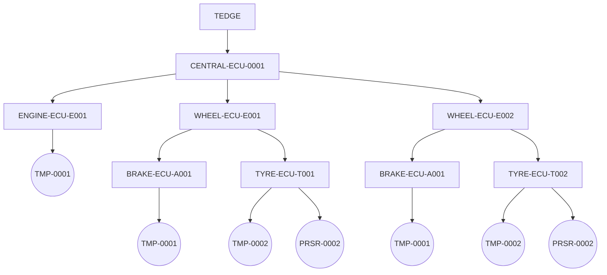

# MQTT Topic Guidelines

This document provides the guidelines for designing MQTT topic structures for thin-edge itself and its extensions.
The goal is to provide a consistent structure so that future extensions are easy and natural.
It should also help plugin/extension developers to define their topic schemes as well, inline with the tedge topics.

## Background

The inconsistency in the existing topic schemes of thin-edge has long been a problem for both users and the
thin-edge dev team to write new applications or new extensions of thin-edge.

Here are a few such examples:
1. Topic for events: `tedge/events/{event-type}/{child-id}`
1. Topic for firmware update commands: `tedge/{child-id}/commands/req/firmware_update`
1. Topic for software update commands: `tedge/commands/req/software/list`

... where there is inconsistency in the placement of child devices and how the commands are grouped.

There are a few other limitations like the lack of support for services on the thin-edge device,
difficulty in extending existing topics with additional sub-topics, etc
which are detailed in the requirements section.

## Domain model influence

The MQTT topics and interactions are modelled around the following entities:

1. **Device**
   A device can be viewed as a composition of hardware components and firmware/software components running on it.
   The device can extract data from these hardware components and emit that as telemetry data using some software on it.
   The device can also control these hardware components using some software.
   The device also manages the firmware and all the software running on it.
   A device could be connected to many other devices as well as multiple cloud providers/instances.
1. **Tedge device**
   The gateway device that is connected to the cloud, where thin-edge.io is installed,
   which emits its own telemetry data and can receive commands to perform operations on the device.
2. **Child device**
   Typically, a different device that is connected to the tedge device, which has its own identity
   which is separate from the tedge device itself.
   It also emits its own measurements and can receive commands.
   A child device need not always be a a physical device, but can also be a logical one,
   abstracting some parts or groups of parts of the main device as well, with its own identity.
   A child device can have further nested child devices as well.
3. **Service**
   A service can be a component or a piece of software running on a device (tedge device or child device).
   For example, a device can have a cloud connector/agent software that can be viewed as a service.
   Any software on the device can be modelled as a service, if monitoring them separately from the device makes sense.
   This abstraction be also be used to isolate various aspects of the device itself into separate groups, but still linked to the device.
   For example, if you model a car as a device, the sensor data coming from different tyres, breaks, engine, infotainment system etc
   can be isolated into their own respective services (more like light-weight child devices).

   A service can have its own telemetry data which is separate from the device's telemetry data.
   For e.g: a service running on a device can report its own RAM or disk usage,
   which is separate from the device's overall RAM or disk usage.
   The services are also usually managed (installed, updated etc) by the device that it is running on and hence
   all commands meant for services are received and managed by that device.
   For e.g: It would be much easier for the device to update/uninstall a service than expecting the service to update itself.
   But, thin-edge does not completely rule out the possibility of services handling commands on their own as well, in future.
   When a service is removed from a device, all data associated with it are obsolete as well, and hence removed.

   Unlike devices that only has a connectivity status, services have a liveness aspect to them as well,
   which conveys if a service is up and running at any given point of time.
   The liveness of services could be critical to the functioning of that device.

   A service does not support nested services either.

When a thin-edge device receives telemetry data for itself or child devices or services running on any of them,
it needs to identify their source so that they can be associated with their twins on the device as well as in the cloud.
For all the MQTT communication, this source info can be part of either the topic or the payload.
Having them in the topics is desired, as that enables easy filtering of messages for a given device or a subset of devices.

## Use-cases

1. Support for nested child devices.
   A deployment where a gateway device is connected to a PLC which is further connected to other sensors/devices is very common.
   There are 3 levels of devices even in this simple deployment which a user might want to replicate in his cloud view as well.
   More complex deployments where a PLC is further connected to more PLCs which are further connected to leaf sensors/actuators
   would require even more levels of nesting.
   When a child device has its own nested child devices, it is expected that the parent child device sends/receives data
   on behalf of all its direct children.
   So, there must be a way for a child device to subscribe for all data meant for itself and its own child devices,
   excluding its siblings and their child devices.
1. Monitor the liveness of a piece of software running on a device (tedge or child) from the cloud.
   Certain services running on a device could be critical to the overall functioning of that device.
   Hence monitoring the health/liveness of these services also would be critical.
1. Gather the usage metrics of a software component(service) running on a device as measurements pushed to the cloud,
   associated to an entity representing that software linked to that device, and not the device itself.
   An identity separate from the device is key here, to ease the management of that component from the cloud.
   It is also required so that when that component is removed from the device, all data associated with it is removed as well.
   It must be linked to a device as software component does not have independent existence and is managed by a device.
   When a device is removed, all services linked to it are removed as well, as they're obsolete without the device.
1. When data from services, connected child devices and even the tedge device itself, are flowing through the MQTT broker,
   it must be easy to identify and filter the messages based on the source.
   A few examples of filtering queries are:
   * All measurements from a specific service
   * All measurements from the tedge device only, excluding the ones from other services and child devices
   * All measurements from all connected child devices
   * All measurements from everything (the tedge device itself, its services and child devices and their services)
   * All messages from a subset of child devices based on some filtering criteria (e.g: device-type, firmware version etc)
1. Since services are typically software components, and the same component would be running on multiple devices,
   the names/ids of these components could be the same on all devices.
   Unlike device ids, we can't expect the service names to be unique across a large fleet of devices either.
   Although we can force the service developers to keep them unique with UUID **suffixes**
   (e.g: `tedge-agent-abcaa88d-8e4f-4272-84fc-fead2a8890b0`) or something like that,
   it would be better to avoid this, as they are really not very user friendly.
   Hence, service ids must be namespaced under each device that it is running on.
1. **TO BE CONFIRMED** Child device ids also must be namespaced under their direct parent
   so that conflicts can be avoided even if another parent device has child devices with the same id.
   It is okay to expect all devices connected to a device to have unique ids,
   but expecting those to be unique across an entire fleet could be far-fetched.
1. If all child devices in a fleet can not guarantee uniqueness in their IDs,
   thin-edge must provide a "registration mechanism" for them to get their own unique IDs,
   which they can use for all their HTTP/MQTT communications.
1. Device registration must be optional if a fleet admin can guarantee unique IDs for all his devices.
   When an explicit registration is optional, child devices get auto-registered on receipt of the the very first message from them.
1. When multiple child devices are connected to a tedge device,
   a given child device should only be able to send/receive data meant for itself and not a sibling child device.
   Thin-edge must provide this isolation in such a way that the even peer child devices can not even view others' data.
   But, when a child device has its own nested child devices, it is expected that
   the parent child device sends/receives data on behalf of all its children.
1. Connect to multiple cloud instances, even of the same provider, at the same time.
   This is a common deployment model for SEMs, where the devices that they produce are labelled and sold by solution providers to end customers.
   The device will be connected to the solution provider's cloud to gather all business data from the customer.
   But, it might have to be connected simultaneously to the SEM's cloud as well so that the SEM can remotely manage that device (for periodic maintenance).
1. All the existing topics like `tedge/measurements`, `tedge/events` imply that the data received on these
   must be forwarded to the cloud as well.
   Currently there is no way to tell thin-edge to just route some data internally and not forward those to the cloud.
   Since filtering and aggregation on the edge is a very common use-case, especially for local analytics, this is highly desired.
1. Enable thin-edge extensions/plugins to register themselves with thin-edge by declaring their capabilities(supported commands).
   Child devices also should be able to do the same so that thin-edge is aware of the supported capabilities of each child device,
   for routing and management of commands meant for them.
1. Keeping the entire device hierarchy in each and every message sent by a device must be avoided,
   as that data is highly redundant and could impact the message sizes badly (sometimes bigger than the payload itself).
   When a device is sending its telemetry data, it shouldn't have to repeat its lineage each and every time.

## Assumptions

1. All services under a given device will have unique ids, namespaced under that device id.
   But the same service name might repeat under multiple devices.
1. All child devices under a given device will have unique ids, namespaced under that device id.
   But different child devices under different parents might have the same name.
1. When device IDs are used in topics for child devices, it is expected that all of them have unique IDs.
   They can use the thin-edge registration service to get unique IDs assigned, if they don't have it on their own.
   These IDs need not be globally unique or even unique across multiple thin-edge devices.
   They just need to be unique under the tedge network that they are part of.

## Requirements

This section is divided into 3 parts:
1. Must-have: for the requirements that must be met by the proposed solutions
2. Nice-to-have: these requirements are not mandatory, but the solution addressing more of these requirements would be a plus
3. Out-of-scope: those that are relevant but out of scope for this design exercise

### Must-have

1. All MQTT topics for main device, child device and services must start with a common prefix like `tedge/`,
   so that all tedge traffic can be filtered out easily from all other data being exchanged over the MQTT broker.
1. The MQTT messages must capture the source of that data that is exchanged through that message:
   whether it came from the tedge device, a child device or a service on any one of them.
   Keeping them in the topics would make source-based filtering of messages easier.
1. Support nested child devices so that telemetry data and commands can be exchanged with child devices of child devices.
1. A separate topic structure to exchange data with services running on a device (main or child)
   which is different from the topics of the device itself.
1. Service `id`s must be namespaced under the device that it is linked to.
   The ids of different services on the same device must be unique,
   but services with the same name/id would be running on multiple devices.
1. A registration service provided by thin-edge to provide unique IDs for requesting child devices.
   This registration step must be optional for devices if they can guarantee unique IDs on their own.
1. Support the following kinds of filtering with minimal effort (ideally with a single wildcard subscription):
   * All data from thin-edge device excluding everything else(other services and child devices)
   * All data from all child devices excluding those from thin-edge device and services
   * All data from all services excluding those from thin-edge device and child devices
   * All data from a specific child device excluding everything else
   * All data from a specific service excluding everything else
1. The topic structure should be ACL friendly so that rules can be applied
   to limit devices and services to access only the data meant for them.
1. Enable easier extension of topics with further topic suffixes in future:
   E.g: Support `type` in the topic for measurements like `tedge/measurements/{measurement-type}`
   or config-type in the topic for config management command: `tedge/commands/req/config_update/<config-type>`
1. Enable exchange of telemetry data just on the local bus, without it getting forwarded to the cloud.
1. Thin-edge must be able to generate unique `id`s for child devices on the local network,
   without consulting with the cloud.
   The device registration service must work even if the tedge device is not connected to a cloud.
   All translation between tedge-local-ids and cloud-twin-ids should be done internally by the cloud mapper.
   It is okay for the mapper to use the same tedge-local-ids in the cloud, if they are unique enough.
   But, the cloud IDs (typically very long and cumbersome) must not be exposed to the tedge network at any cost.
1. A registration mechanism for thin-edge plugins to declare their capabilities and other necessary metadata to thin-edge.
1. Enable a device to subscribe to all the data meant for itself, its services and all its descendent child devices.
   This subscription mechanism should prevent a device from subscribing to messages of all other devices.
1. Avoid entire device hierarchy in message payloads to avoid sending redundant data every time some data is sent.
   The parent hierarchy of a child device must be established only once, during its registration
   and thin-edge must be able to map the parent hierarchy from its unique id from then on.

### Nice-to have

1. Avoid using the device id in the topics for the main tedge device to keep those well-known topics simple.
   Use aliases like `main` or `master` instead, if an identifier is really required.
   Using `id`s for child devices might be unavoidable.
1. Consistency/symmetry in the topic structures for the main device, child device and services.
   For e.g: if the telemetry topic for a child device is like: `tedge/level2/level3/level4/telemetry/...`
   it would be better if the `telemetry` subtopic is at the 5th level in the topics for the main device and services as well,
   as that would make wildcard subscriptions like "all telemetry data from all sources" easier.
1. Dynamic creation/registration of child devices on receipt of the very first data that they send.
   This is desired at least for immediate child devices, if not for further nested child devices.
1. Easy to create static routing rules so that it is easy to map a local MQTT topic for a nested child device
   to the equivalent cloud topic for its twin.
1. It would be ideal if the context/source of data (tedge device, service or child device)
   can be understood from the topic directly.
   For e.g: a topic scheme like `tedge/main/{id}`, `tedge/service/{id}` and `tedge/child/{id}` is more user-friendly
   than a simpler context agnostic scheme like `tedge/{id}` where `id` can be for any "thing".
1. Limit the topic levels to 7 as AWS IoT core has a [max limit of 7](https://docs.aws.amazon.com/whitepapers/latest/designing-mqtt-topics-aws-iot-core/mqtt-design-best-practices.html)

### Out of scope

1. Routing different kinds of data to different clouds, e.g: all telemetry to azure and all commands from/to Cumulocity.
   Even though this requirement is realistic, thin-edge MQTT topics must not be corrupted with cloud specific semantics,
   and the same requirement will be handled with some external routing mechanism(e.g: routing via bridge topics)

## Example deployment

Here is a sample deployment structure for a smart two-wheeler that is used in the examples below:



As you can see, the ECUs for the front and rear wheels have unique IDs: `WHEEL-ECU-E001` and `WHEEL-ECU-E002`,
as they exist at the same level, connected to the central ECU(`CENTRAL-ECU-0001`).
But, the brake ECUs connected to both the wheels may have the same ID, as they are not linked directly anyway.
Even the sensors attached at many levels in such a complex deployment may have the same IDs(`TMP-0001`).

So, the proposed solutions must address such ID clashes in a deep nested hierarchies.

## Proposals

### Proposal 1: Dedicated topics for devices and services

This proposal is built on the following assumptions/constraints:
* thin-edge can identify the child devices(the nested ones as well), and all the services with unique IDs.
* All child-devices connected to a parent device will have unique IDs under its parent namespace,
  but not necessarily across the entire tedge namespace/hierarchy.
* If all child devices **can not** guarantee that uniqueness across the entire hierarchy,
  then they are expected to register with thin-edge to get that unique ID generated.
* Given that unique ID, thin-edge can identify its entire parent lineage and descendent child devices.
  Thin-edge internally maintains this mapping information as child devices register with it.
* If all child devices **can** guarantee ID uniqueness across the entire hierarchy,
  they can skip this registration step.
* Services need not have unique IDs across the entire hierarchy.
  They just need to have unique IDs under their parent's namespace.

Topics to have device id as the top level prefix with distinction on the target: device or service as in:
`tedge/<device-id>/<target-type>/...`

For tedge device: tedge/main/...
For tedge device services: tedge/main/service/<service-id>/...
For child devices: tedge/<child-id>/...
For child device services: tedge/<child-id>/service/<service-id>/...

... where `main` is used as an alias for the tedge device id.

#### Telemetry

For telemetry data, the topics would be grouped under a `telemetry/` sub-topic as follows:
* Measurements: `tedge/<device-id>/<target-type>/telemetry/measurements`
* Events: `tedge/<device-id>/<target-type>/telemetry/events/<event-type>`
* Alarms: `tedge/<device-id>/<target-type>/telemetry/alarms/<alarm-type>/<severity>`

Examples:
For tedge device: `tedge/main/telemetry/measurements`
For tedge device services: `tedge/main/service/<service-id>/telemetry/measurements`
For child devices: `tedge/<child-id>/telemetry/measurements`
For device services: `tedge/<child-id>/service/<service-id>/telemetry/measurements`

**Why have the redundant `/telemetry` subtopic level?**
To have a clear separation from commands or other kinds of data that might get added in future.
It simplifies subscriptions for "all telemetry data from a device" to just `tedge/<device-id>/+/telemetry/#`.
Without that `telemetry` grouping level, doing such a subscription would be difficult as you you'll have to subscribe to
`tedge/<device-id>/+/measurements/#`, `tedge/<device-id>/+/events/#` and `tedge/<device-id>/+/alarms/#` separately.
Something simpler like `tedge/<device-id>/+/#` would cover a lot more than just telemetry data: commands as well.
It also eases defining ACL rules for telemetry data separately from those of commands.

**Why have the `/service` subtopic level and not have the <service-id> directly?**
Primarily for future-proofing as `service` is a new kind of child abstraction that we've added now.
If another abstraction comes in the future, say `plugin`, they can be namespaced under a `plugin/` subtopic.

#### Commands

Similarly, all commands would be grouped under a `commands/` sub-topic as follows:

For requests: `tedge/<device-id>/<target-type>/commands/req/<operation-type>/<operation-specific-keys>...`
For responses: `tedge/<device-id>/<target-type>/commands/res/<operation-type>/<operation-specific-keys>...`

The `operation-specific-keys` are optional and the number of such keys (topic levels) could vary from one operation to another.

Examples:
* Software list operation: `tedge/main/commands/req/software_list` and `tedge/main/commands/res/software_list`
* Software update operation `tedge/<child-id>/commands/req/software_update` and `tedge/<child-id>/commands/res/software_update`
* Firmware update operation `tedge/main/commands/req/firmware_update` and `tedge/main/commands/res/firmware_update`
* Device restart operation `tedge/main/commands/req/device_restart` and `tedge/main/commands/res/device_restart`
* Configuration snapshot operation `tedge/main/<service-id>/commands/req/config_snapshot` and `tedge/main/<service-id>/commands/res/config_snapshot`
* Configuration update operation `tedge/<child-id>/<service-id>/commands/req/config_update` and `tedge/<child-id>/<service-id>/commands/res/config_update`

Although all the above examples maintain consistent structure by ending with the `<operation-type>`,
further additions are possible in future if desired for a given operation type.
For e.g: `tedge/main/commands/req/config_update/<config-type>` to address a specific `config-type`

Similarly, for the response topics, another variation that supports multiple response types is also feasible, as follows:
`tedge/main/commands/<res-type>/<op-type>`

Examples:
* `tedge/main/commands/executing/config_update`
* `tedge/main/commands/successful/config_update`
* `tedge/main/commands/failed/config_update`

Child devices follow a similar structure for commands as well:
* `tedge/<child-id>/commands/req/software_list`
* `tedge/<child-id>/commands/res/software_update`

#### Registration service for child devices

Immediate and nested child devices can be registered with thin-edge using its registration service,
by sending the following MQTT message to the topic: `tedge/main/register/req/child`:

```json
{ 
   "parent": "<parent-device-id>",
   "id-prefix": "<desired-child-id-prefix>",
   "capabilities": {
      "<capability-1>": {},  //capability-1 specific metadata
      "<capability-2>": {},  //capability-2 specific metadata
      ...
   }
}
```

The `parent-device-id` is the device-id of the direct parent that the child device is connected to.
The payload can have other fields describing the capabilities of that device as well (config management, software management etc).

```admonish warning
The exact topic keys and payload format for this init contract can be discussed and refined separately.
The focus here is just on the MQTT topic structure.
```

Thin-edge needs to maintain the lineage (hierarchy of parent devices) of all descendent child devices in its internal state,
so that it can be looked up while receiving any data from them.
Even though the child device only declares its immediate parent in the registration message,
the entire lineage can be traced back with a recursive lookup on that `parent-device-id`.

The registration status, whether the device registration succeeded or not, is sent back on `tedge/main/register/res/child`,
with the internal device id used by thin-edge to uniquely identify that device as follows:

```json
{
   "id": "<generated-id>",
   "status": "successful" 
}
```

The `<generated-id>` will use the `<desired-child-id-prefix>` sent in the registration request.

A failure is indicated with a failed status: `{ "status": "failed" }`.

Once the registration is complete, these nested child devices can use the `tedge/<generated-id>` topic prefix
to send telemetry data or receive commands as follows:

* Measurement: `tedge/descendent/<internal-id>/telemetry/measurements`
* Command: `tedge/descendent/<internal-id>/commands/req/software_list`

#### Automatic registration

Automatic registration is supported for services as they are expected to have unique names under each device namespace,
and they do not supporting nesting, eliminating any name clashes that way. 
So, it is easier to associate those services directly with their parent devices, as the parent id is part of the topic.

It can't be supported for child devices with this topic scheme as there's no distinction between
immediate child devices and nested child devices in the topics.

If it really needs to be supported, at least for immediate child devices,
they need to declare somehow that they are immediate child devices or not,
which can be done by adding that distinction in the topics as follows:

* For immediate child devices: `tedge/child/<child-id>/...`
* For nested child devices: `tedge/descendent/<child-id>/...`

.. so that automatic registration can be done for everything coming from `tedge/child/...` topics.
If keeping that information in the topics is not desired, it can be kept in the payload as well,
with the caveat that defining static routing rules would not be possible with it.

**Pros**

1. The context on whether the data is coming from the parent, a child or a service is clear from the topics.
1. Automatic registration is possible at least for services and even child devices with some tweaks.

**Cons**

1. The topics are fairly long and with extensions might easily cross the 7 sub-topic limit of AWS.

### Proposal 2: Unified topics for every "thing"

Use just `id`s in the topic for everything: including parent device, child devices and services.
with just the distinction between device or service as follows:
`tedge/<context>/<id>/...`

For tedge device: `tedge/main-device/<id>/...`
For child device: `tedge/child-device/<id>/...`
For services on tedge device: `tedge/main-service/<id>/...`
For services on child device: `tedge/child-service/<id>/...`

Examples:
* Main device measurements: `tedge/device/<tedge-device-id>/telemetry/measurements`
* Main device service measurements: `tedge/service/<service-id>/telemetry/measurements`
* Child device measurements: `tedge/device/<child-device-id>/telemetry/measurements`
* Child device service measurements: `tedge/service/<service-id>/telemetry/measurements`

The `id` could be the main device id, service id or child device id.
The relation between the "parent and its child devices" or "devices and the services linked to them"
are defined only during the bootstrapping phase.

```admonish note
`tedge/device/main` could be just used as an alias for `tedge/device/<id>` for simplicity.
```admonish note

**Pros**

1. Due to the lack of distinction in the topics between parent devices and child devices,
   it is easier to write code for "the device" irrespective of whether it is deployed as a parent or child.

**Cons**

1. Not easy to differentiate the context(from parent or child) easily from the message.
1. The `id`s must be unique between all devices and services in a deployment.
1. Not easy to do subscriptions like: "measurements only from child devices or only from services, excluding parent"
1. Difficult to do any subscriptions like "measurements from all services on a given child device",
   without keeping track of all the `id`s of services registered with that child device.
   Wild card subscriptions are not possible at all.
1. No automatic registration as bootstrapping is mandatory
